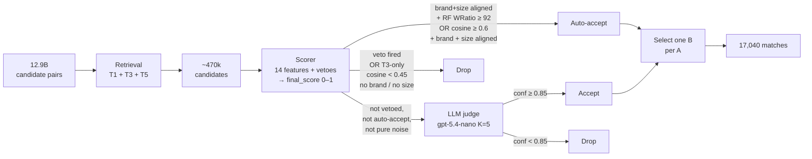
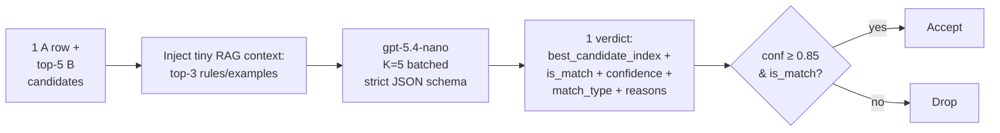
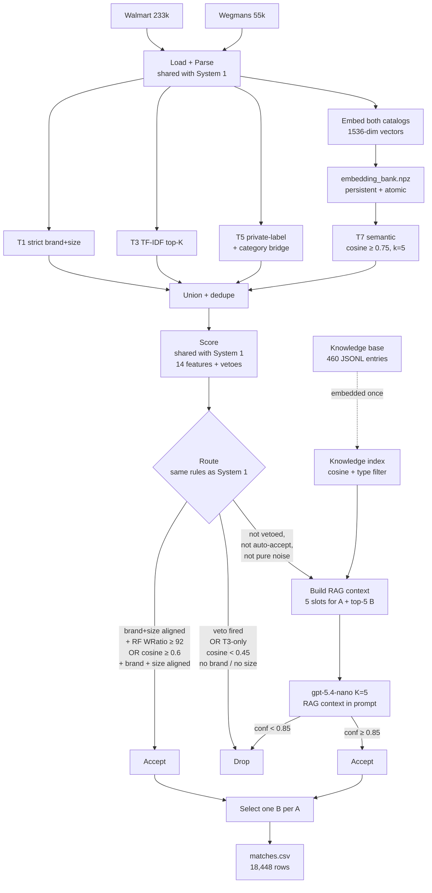

# Matching 233k Walmart products to 55k Wegmans products

**Mark Hanna** · BetterBasket technical assessment

Two systems built. Eval-set precision **1.00 / 1.00**. Recall lifted
from **0.66 → 0.76**. **18,448** matches shipped (4.6× the 4k target).

---

## The problem

**Match 233,195 Walmart products → 55,516 Wegmans products.**
Deliverable: `item_id_A,item_id_B` CSV, **≥ 4,000 pairs.**

- **12.9 billion** candidate pairs (full cross product)
- **Zero UPC overlap.** Zero ID overlap. Top-level categories don't align
- **Two match types** to handle differently:
  - National-brand exact (Cheerios = Cheerios)
  - Private-label equivalent (Great Value milk ≈ Wegmans milk)

---

## EDA findings that shaped the design

| Finding | Design consequence |
|---|---|
| **0 UPC overlap, 0 ID overlap** | Can't join. Must match by text/structure |
| **Top-level categories don't align** | Need an A→B category bridge |
| **Brand names vary** (`Ben & Jerry's` vs `ben&jerrys`) | Char-ngram TF-IDF + brand canonicalization |
| **Private-label exists on both sides** | Dedicated retrieval source (T5) |

**Category bridge example.** Walmart category `Food / Beverages / Tea`
maps strongly to Wegmans category `Grocery / Beverages / Tea`.
The bridge is learned from co-occurring brand + size seed pairs, not
from string similarity on the category names themselves (which fail —
different taxonomies).

**Private-label example.** Walmart's `Great Value Whole Milk 1 Gal` and
Wegmans' `Wegmans Whole Milk 1 Gallon` share **zero** brand tokens. A
strict brand block would never join them. T5 instead blocks on
(private-label-flag = true) + (bridged category) + (size match) and lets
the LLM verify.

---

## Two systems, same eval set

**System 1 (MVP):** retrieval + deterministic scoring + LLM veto.
Ships fast, proves the funnel.

**System 2 (RAG):** adds OpenAI semantic embeddings + a 460-entry
knowledge base. Targets specific recall gaps.

Both judged against the **same 97-pair labeled eval set** (9 strata).
No moving goalposts.

---

## System 1 architecture



**Six stages, each cheaper-per-pair as you move right.**
12.9B -> ~470k candidates -> 56,495 LLM batches -> 17,040 matches.
Output mix: **22% rules-only auto-accept, 78% LLM-confirmed.**

---

## System 1: three retrieval sources

| Source | What it catches | What it misses |
|---|---|---|
| **T1** strict brand + size match | National brands at standard sizes | Paraphrased names |
| **T3** TF-IDF top-K (word 1-2g + char_wb 3-5g) | Anything with literal token overlap | Pure paraphrase |
| **T5** private-label + category bridge | Store-brand pairs via cat-A → cat-B mapping | Cross-category |

**T1 — strict brand + size block, ranked by name similarity**
- **Hard block** on `(brand_canonical, unit_bucket OR total_bucket)` — brand and parsed size bucket must align
- **Rank** within the block by **RapidFuzz WRatio on `name_norm`** (A's normalized name vs B's normalized name)
- Keep **top-3** per A, no WRatio floor — the block itself is the precision gate

**T3 — TF-IDF top-K cosine**
- Two analyzers on A+B: **word 1–2gram + char_wb 3–5gram** (~530k joint features)
- L2-normalize, sparse mat-mul in 2k-row batches
- **K = 20** per A, **cosine floor = 0.40**
- Measured: **89% rank-1 precision at cosine ≥ 0.6** on eval set

**T5 — private-label via category bridge**
- Restrict both sides to private-label-flagged rows
- Block on compatible parsed size bucket (`unit_bucket` or `total_bucket`)
- Require B's category to appear in the learned A→B bridge for A's category
- Score by **RapidFuzz WRatio ≥ 60** on name, top-5 per A
- Bridge entries require `support ≥ 10` and `share ≥ 0.10`

Three sources → unioned → deduped → **~470k candidates.**

**Example: what each retrieval source contributes**

| Retriever | Example candidate it can add | What the retriever did |
|---|---|---|
| **T1** | A: `Pillsbury Banana Quick Bread & Muffin Mix, 14 oz` → B: `Pillsbury Quick Bread & Muffin Mix, Banana` | Same canonical brand (`pillsbury`) + compatible parsed size, then ranked by RapidFuzz name similarity |
| **T3** | Same A/B pair as above | TF-IDF also found it by token overlap: `pillsbury`, `banana`, `quick bread`, `muffin mix` |
| **T5** | A: `Great Value Tomato Basil Pasta Sauce, 24 oz` → B: `Wegmans Tomato Basil Pasta Sauce, 24 oz` | Both private-label, compatible size, and A's category maps to B's category through the learned category bridge |

After union + dedupe, the T1/T3 duplicate becomes one row:

```
item_id_a:        2069913   ("Pillsbury Banana Quick Bread & Muffin Mix, 14 oz")
item_id_b:        98431     ("Pillsbury Quick Bread & Muffin Mix, Banana")
candidate_source: T1+T3                ← merged label, both retrievers found it
candidate_score:  95.0                 ← max raw source score kept for audit/tie-break
features:
  rapidfuzz_wratio_name: 95.0          ← contributed by T1 / recomputed by scorer
  block_brand:           pillsbury     ← contributed by T1
  tfidf_cosine:          0.71          ← contributed by T3
```

The T5 private-label row stays as `candidate_source=T5` unless another
retriever also found the same `(item_id_a, item_id_b)` pair. Source
labels are joined (`T1+T3`, `T3+T5`, etc.) so the audit trail survives.

---

## Inside the scorer

For every candidate pair, compute 14 raw features. **Five of them feed
the weighted composite score; the rest support vetoes, routing, and audit.**

### What contributes to `final_score` (0–1)

| Component | Max weight | How it scales |
|---|---|---|
| **Brand relation** | **0.35** | exact → 0.35 · alias → 0.30 · private-label-compatible → 0.18 · unknown → 0.05 · conflict → 0 |
| **Size relation** (unit) | **0.30** | same → 0.30 · multipack → 0.22 · near → 0.18 · unknown → 0.06 · off → 0 |
| **Name similarity** | **0.18** | `0.18 × (RapidFuzz WRatio / 100)` |
| **TF-IDF cosine** | **0.12** | `0.12 × cosine`, clipped to [0, 1] |
| **Category overlap** | **0.05** | `0.05 × token Jaccard` of A's vs B's raw category-path tokens (**no bridge** — A/B taxonomies misalign, so weight kept small) |
| **Sum** | **1.00** | All five summed → `final_score` |

Brand and size dominate by design — a perfect brand + perfect size
match alone is already 0.65 before the LLM even sees the pair.

### What forces a drop (any one fires → `final_score = 0`)

| Hard veto | Fires when |
|---|---|
| **brand_conflict** | A and B have different known brands (skipped if both are private-label) |
| **size_dim_conflict** | A and B size dimensions don't match (e.g., volume vs weight, liters vs grams) |
| **flavor_conflict** | A and B carry **disjoint** flavor tokens (slot-aware: shared overlap → no veto) |
| **form_conflict** | A and B carry disjoint form tokens (e.g., liquid vs powder, ground vs whole-bean) |
| **organic_conflict** | One side is flagged organic, the other is explicitly not, on a food-like product |

Other features written to the audit table but not directly weighted:
`token_jaccard_name`, `total_size_relation`, `pack_count_relation`,
`candidate_source`, and the veto flags. T5 enters the scorer just like
T1/T3: it contributes candidate rows plus source features
(`candidate_source=T5`, `private_label_both`, RapidFuzz score). The
scorer then recomputes the shared 14 features; private-label pairs get
their score through `brand_relation=private_label_compatible`, compatible
size, name similarity, TF-IDF if present, and category-token overlap.

### Routing policy

- **Auto-accept** if no veto and the pair is in a measured high-precision tier:
  - brand-aligned + size-aligned + RapidFuzz `≥ 92`, or
  - TF-IDF cosine `≥ 0.6` + brand-aligned + positive size evidence
- **Route to LLM** if not vetoed, not auto-accepted, and not pure noise
- **Drop** if any hard veto fired, or if it is a low-signal T3-only pair

The thresholds were tuned on the 97-pair eval set: only the tiers with
measured near-perfect precision auto-accept; ambiguous candidates go to
the LLM.

---

## The LLM call

For each A row routed to the judge, we batch the **top-5 B candidates**
(ranked by `final_score`) into a single LLM call:



**Per call:**
- **Input:** 1 A row + up to 5 B candidates + top-3 retrieved rule/example snippets
- **Output:** strict JSON, **picks the single best B** out of the 5 (or none)
- **Acceptance gate:** `confidence ≥ 0.85` AND `is_match = true`

**Why K=5 batching:** one A row shares context across 5 candidates →
**~3.5× cheaper** than one-pair-per-call, ~3× faster.

**Tiny RAG:** TF-IDF index over 10 hand-written rubric clauses + the
labeled eval pairs. Retrieve top-3 most relevant entries per call; the
mix can be rules or examples.
Keeps the prompt grounded without exploding token cost. (System 2's
RAG is the full 460-entry knowledge-base version of this same idea.)

**Example LLM output** (strict JSON, one per batch):

```json
{
  "best_candidate_index": 2,
  "is_match": true,
  "match_type": "exact_national_brand",
  "confidence": 0.93,
  "reason_codes": [
    "same_brand",
    "compatible_size",
    "same_form",
    "marketing_drift"
  ]
}
```

→ A row matched to B candidate at index 2. Confidence 0.93 ≥ 0.85 →
**accepted.** Reason codes feed the audit log so we can analyze
acceptance patterns later (e.g., "how often does `marketing_drift`
co-occur with rejections?").

---

## Select one B per A

After auto-accept + LLM-accept, an A row can still have multiple
surviving B candidates (from different retrievers, or from the K=5
batch). We pick exactly one:

```
all (A, B) accepted pairs
        │
        ▼
   sort by:
   final_score   ↓   ──►   primary signal (scorer's composite)
   llm_confidence ↓   ──►   tie-break on LLM certainty
   candidate_score ↓  ──►   tie-break on raw retriever score
        │
        ▼
   keep first per A   →   one B per A → matches.csv
```

Multiple A rows **can** still map to the same B (legitimate: distinct A
SKUs of the same product).



Two new components vs. System 1: **T7** (semantic retriever fed by the
embedding bank) and **the RAG context builder** (fed by a 460-entry
knowledge base). Everything else — load, parse, score, route, select —
is reused from System 1 via an `importlib` shim.

---

## What System 2 adds

**T7 — semantic retrieval**
- Embeds every A and every B as a 1536-dim vector (`text-embedding-3-small`)
- Per A row: top-5 B by cosine, **floor = 0.75**
- Added as a 4th candidate source alongside T1/T3/T5
- Persistent `embedding_bank.npz` cache → re-runs cost $0

**Per-candidate-group RAG context bundle**
- For every A routed to the LLM, build a **5-slot context packet** *before* the call
- The packet is shared across that A's **up to 5 B candidates**
- Slots: `rules`, `aliases`, `bridge`, `accepted_examples`, `rejected_examples`
- `rules`, `accepted_examples`, and `rejected_examples` come from semantic KB search
- `aliases` and `bridge` come from deterministic Python lookups
- Injected into the judge prompt — model still picks 1 best B from 5

**Same model, same K=5 batching, same `conf ≥ 0.85` gate.**
Only retrieval and prompt context change.

### Why we added each — and what it fixed

| Change | The S1 gap it targets | Eval-set lift |
|---|---|---|
| **T7 semantic** | TF-IDF needs literal token overlap → misses paraphrase (`Italian-style Marinara` vs `Tomato-Basil Sauce`) | `T_strong_tfidf` recall **0.38 → 0.50**, `T_weak_tfidf` **0.00 → 1.00** |
| **Per-pair RAG** | Rubric can't grow past ~30 clauses without the LLM ignoring late instructions → ceiling on private-label recall | `A_private_high` recall **0.29 → 0.57** |

**Net effect:** +0.10 recall, +1,408 matches shipped, zero false
positives added in any stratum.

---

## The 460-entry knowledge base

The KB is just 6 JSONL files, bootstrapped once from existing EDA
artifacts. Each entry has typed applicability fields so retrieval can
pre-filter before falling back to cosine.

| File | Source | Count |
|---|---|---|
| `rules.jsonl` | Hand-written rubric clauses | 10 |
| `brand_aliases.jsonl` | EDA alias candidates (score ≥ 95) | 64 |
| `category_bridges.jsonl` | EDA bridge (support ≥ 10, share ≥ 0.4) | 286 |
| `accepted_examples.jsonl` | Eval-set positives | 41 |
| `rejected_examples.jsonl` | Eval-set negatives | 56 |
| `edge_cases.jsonl` | Hand-curated tricky patterns | 3 |

Typed fields on each entry (`match_type`, `requires_brand_relation`,
`product_domain`, `tags`, …) let the retriever **pre-filter** so a
"private-label organic exception" rule never leaks into a national-
brand judgment.

---

## Example: RAG context bundle

For one A row + 5 B candidates routed to the LLM, the formatted prompt
block has this shape:

```yaml
A: "Great Value Pasta Sauce Tomato Basil 24oz"

B candidates (ranked by final_score):
  0. "Wegmans Italian-Style Marinara, 24 oz"
  1. "Wegmans Tomato Basil Pasta Sauce, 24 oz"
  2. "Classico Tomato & Basil Pasta Sauce, 24 oz"
  3. "Rao's Homemade Marinara Sauce, 24 oz"
  4. "Hunt's Tomato Sauce, 24 oz"

--- Injected RAG context ---

Relevant rules:
  - rule_private_label_equivalence:
      "Two private-label products of the same specific product, same size,
       same form qualify as private_label_equivalent."
  - rule_marketing_drift:
      "Different marketing taglines on the same SKU do not break a match
       when brand, size, form, and product family all agree."
  - rule_flavor_conflict:
      "Different flavors, scents, shades, or formulations are no_match unless
       explicitly equivalent."

Brand alias checks:
  - B[0]: great value vs wegmans -> are_aliases=false
  - B[1]: great value vs wegmans -> are_aliases=false
  - B[2]: great value vs classico -> are_aliases=false
  - B[3]: great value vs rao's -> are_aliases=false
  - B[4]: great value vs hunt's -> are_aliases=false

Category bridge:
  A category "Sauces & marinades" typically maps to B categories:
  pasta sauce (share=0.38); gravy, sauces & seasoning mixes (share=0.25);
  bbq sauces (share=0.12)

Similar accepted examples:
  - acc_P0021:
      A "(24 pack) Great Value Tomato Paste, 6 oz" vs
      B "Wegmans Tomato Paste" → private_label_equivalent
  - acc_P0093:
      A "Great Value Organic Tomato Sauce 8 oz" vs
      B "Wegmans Organic Tomato Sauce 8 oz" → private_label_equivalent

Similar rejected examples:
  - rej_P0033:
      A "GV 3 Cheese Pasta Sauce, 24oz" vs
      B "Wegmans Mushroom Sauce" → no_match, different flavor/use
  - rej_P0036:
      A "Great Value Gluten Free Elbow Pasta, 16 oz" vs
      B "Wegmans Ziti Pasta" → no_match, different pasta shape/formulation
```

This bundle is **pre-fetched deterministically** (the LLM doesn't get
to choose what's in it). The exact rule/example entries depend on cosine
retrieval for the A+top-5-B query, but the headings and deterministic
alias/bridge formats above match the code. System 1's prompt would only
contain the small rubric/tiny-RAG context; System 2 adds the full 5-slot
packet — and that's where the recall lift comes from.

---

## Results: head-to-head

| Metric | System 1 | System 2 | Delta |
|---|---|---|---|
| **Matches shipped** | 17,040 | **18,448** | **+1,408 (+8.3%)** |
| **Eval-set precision** | 1.00 | **1.00** | tied perfect |
| **Eval-set recall** | 0.66 | **0.76** | **+0.10** |
| **Eval-set F1** | 0.79 | **0.86** | **+0.07** |
| **False positives across 9 strata** | 0 | **0** | none added |
| LLM cost | $0.65 | ~$8 | +$7.35 |
| Wall clock | 5h 30min | 7h 10min | +1h 40min |

**System 2 strictly dominates** on the deliverable.
Cost delta is a rounding error vs. the recall lift.

---

## What I'd ship next

Ordered by leverage:

1. **Expand eval set to 300+ pairs.** Current 97 is the rate-limiter on every threshold decision
2. **Fix 3 deferred parser bugs.** Leading-decimal sizes (`.5 L`), `count:1` bucket, detached `(3 pack)` — largest single recall gap
3. **Agentic judge loop** — let the LLM call typed tools instead of one-shot judging. From `SYSTEM_2_DESIGN.md` Appendix C, the 4 starter tools:
   - `compute_size_compatibility` — unit conversion + multipack math (the LLM does this unreliably; projected +9.8 recall pts on 4 eval rows)
   - `resolve_brand_and_extract` — brand normalization, manufacturer hierarchy, category-guarded aliases (45.9% of A rows have empty `brand_raw`)
   - `compare_category_bridge` — per-candidate bridge verdict
   - `classify_variant_conflict` — precision-focused tool for model-line / scent / shade mismatches the model misses
4. **Self-improving KB** — auto-grow from high-confidence accepted/rejected judgments
